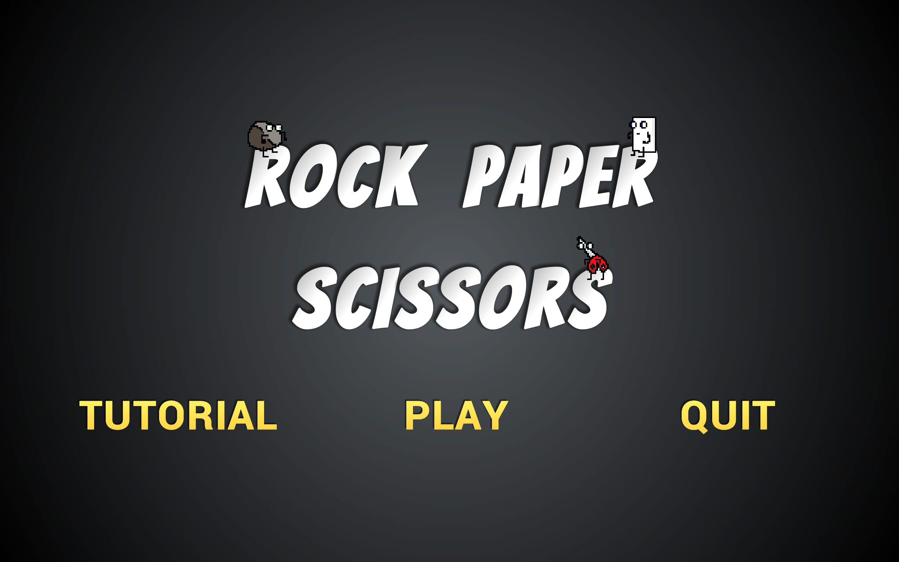
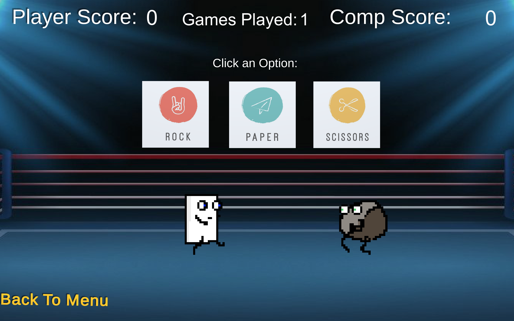

# Rock-Paper-Scissors-Unity-Game
Rock! Paper! Scissors! Developed with C# and Unity, this project puts a creative twist on the classic game Rock-Paper-Scissors!

This game of Rock-Paper-Scissors takes place in a boxing ring and pits the custom pixel art characters against eachother.
Click one of the three boxes to select your choice of either rock, paper, or you guessed it... scissors. Your champion will emerge from the left side of the screen while the computer simultaneously chooses one of the three options at random to fight your character.  The two will duke it out in the center of the screen until one defeats the other.  The first to 10 points wins!

Main Menu.

Play screen where the player has chosen paper and the computer has chosen rock.

